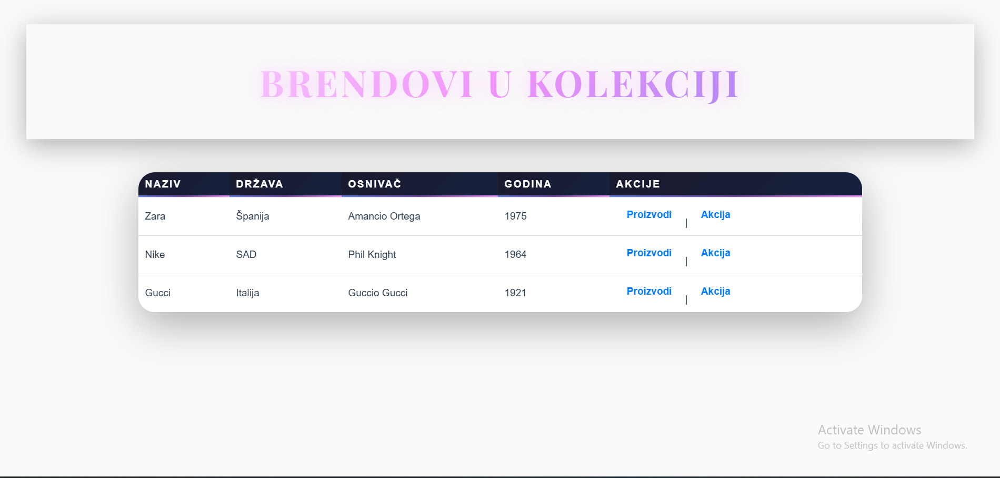

#  Fashion Collection – Brand & Product App

### Autori:
- Adna Kargic
- Asja Kadric

---

### Opis aplikacije:
Aplikacija **Fashion Collection** prikazuje listu modnih brendova i njihovih proizvoda.  
Koristi **Spring Boot** i **Thymeleaf** za dinamički prikaz podataka.

---

###  Model i relacija:
- **Brand** ima više **Product** objekata (relacija 1:N)  
- `Brand.java` sadrži:
  - id, name, country, founder, foundedYear, products  
- `Product.java` sadrži:
  - id, name, category, price, color

---

### Prikaz u pregledniku:
- `/brands` – prikazuje listu svih brendova  
- `/products/{id}` – prikazuje proizvode određenog brenda  
- `/brands/action/{id}` – izračunava prosječnu cijenu proizvoda brenda  

---

### Screenshot aplikacije:

---

### Tehnologije:
- Java 17  
- Spring Boot  
- Thymeleaf  
- HTML / CSS
